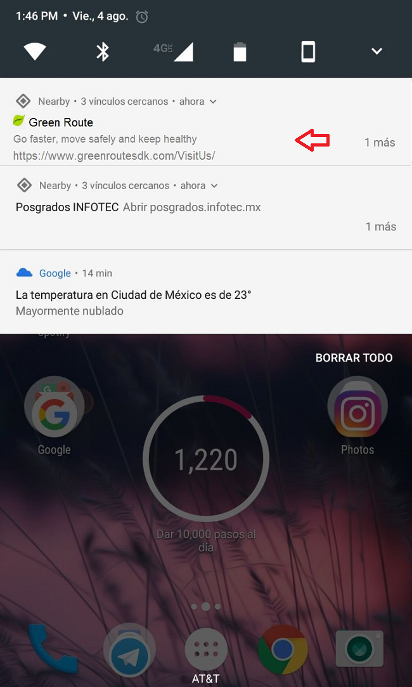
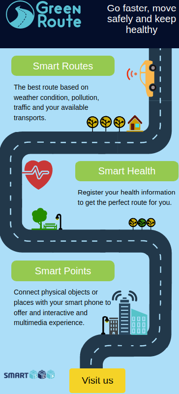

# Manual de aplicación para Ciudades Inteligentes

# 1. Introducción

Desde este siglo, la mitad de la población del mundo vive en áreas urbanas comparado con el 15% 
que vivió en ciudades hace más de cien años. El aumento de la población urbana del mundo, de doscientos 
a casi tres mil millones en sólo cien años, es un claro indicio de que mucha gente se traslada 
de las zonas rurales a los centros urbanos y también aumenta el número de personas nacidas en las ciudades.
Si combinamos estos datos con el hecho de que el área que es urbana ha crecido solamente al 2.8% 
de la superficie total de la tierra es una indicación clara de la superpoblación en varias ciudades.
Por lo general, muchos ecosistemas alrededor de las áreas urbanas son más biodiversos que los monocultivos 
rurales, sin embargo, a medida que las ciudades crecen en tamaño, comienzan a sufrir de una mayor congestión, 
mayores índices de criminalidad y contaminación del aire.
Por lo general, las ciudades sufren para gestionar la energía, la movilidad, el medio ambiente, los servicios públicos, 
los residuos, la salud, la seguridad, etc. Por lo cuál los recursos financieros y humanos necesarios para apoyar 
a las ciudades son inmensos.

## 1.1 Audiencia
Este documento está destinado principalmente a:

* Desarrolladores interesados en implementar aplicaciones inteligentes de movilidad basados en FIWARE 
en una ciudad específica.

* Desarrolladores interesados en adoptar FIWARE o contribuir a la iniciativa.

=================================================================================

# 2. Aplicación de movilidad inteligente: Green Route

La aplicación desarrollada en el ámbito de Ciudad Inteligente (llamada Green Route) se centra en apoyar la movilidad 
en ciudades de alta contaminación, como la Ciudad de México, con el objetivo de mejorar la calidad de vida de los 
ciudadanos y fomentar comportamientos respetuosos con el medio ambiente. El objetivo de Green Route es ayudar al 
usuario final a determinar la mejor ruta a seguir para llegar a un destino, teniendo en cuenta el perfil del usuario 
(como las condiciones de salud) y las preferencias del usuario, como el tipo de transporte.

## 2.1 Resumen

* Green Route reune información de unidades de monitoreo de la calidad del aire del gobierno de la Ciudad de México
y de componentes de IoT desarrolladas en el proyecto de SmartSDK. También es la primera vez, que en la Ciudad de México
 la información de calidad del airea se combina con datos de rutas de transporte público.

* Green Route se desarrolló usando las siguientes tecnologías: Angular 2.0, HTML 5.0, Java, Bootstrap, y TypeScript.
Estas tecnologías permite que Green Route se use en plataformas móviles y web.

## 2.2 Fuentes de datos

* Se cuenta con los datos de la calidad del aire de la Ciudad de México proveniente de 47 estaciones fijas. 
Los datos son obtenidos a partir de un crawler que se desarrolló y que obtiene los datos de cada estación 
cada hora.

* Datos de la calidad del aire de la ciudad de Murcia, España. Los datos son monitoreados a través de un
 Smart Spot [SmartSDK IoT](https://smartsdk.eu/wp-content/uploads/sites/8/2017/06/SmartSDK_D3.2v1.2_FINAL.pdf).

* Datos de las condiciones metereológicas de la Ciudad de México. Los datos son monitoreados a través de
Cloudino [SmartSDK IoT](https://smartsdk.eu/wp-content/uploads/sites/8/2017/06/SmartSDK_D3.2v1.2_FINAL.pdf)

* El revolucionario humano como sensor es un elemento clave para Green Route. Los usuarios envían 
un surtido de alertas como accidentes, atascos, contaminación, etc. De esta manera, las alertas generadas por 
los usuarios son una fuente de datos para Green Route.

* También un componente NGSI SDK ha sido desarrollado para comunicar datos de contexto hacia el Orion Context
Broker, el cual es el componente de FIWARE que centraliza la información de contexto.
=================================================================================

# 3. Green Route
El objetivo de Green Route es ayudar al usuario final a determinar la mejor ruta a seguir para llegar a un destino,
teniendo en cuenta el perfil del usuario (como las condiciones de salud) y las preferencias del usuario, como el 
tipo de transporte. Green Route propone la ruta ideal para el usuario, evitando rutas con altos niveles de 
contaminación, embotellamiento o polen, etc., permitiendo por ejemplo, obtener las rutas preferidas para personas 
con enfermedades respiratorias.

##3.1 Obtención de la aplicación
Tenemos un conjunto de beacons configurados que transmite la URL de una página web ligera con información 
sobre Green Route. En los casos, en donde el usuario tiene activo el servicio de Physical web en su teléfono
móvil, entonces el usuario puede recibir una notificación proveniente del beacon. Esta notificación aparecerá
en su bandeja de notificaciones.

Al abrir la URL que se recibe y al pulsar sobre el botón de "Visit Us", el usuario será redireccionado hacia el
sitio de Green Route.

 

## 3.2 Registro a Green Route
Para iniciar a usar la aplicación de Green Route, es necesario registrarse.
El enlace para el registro es [www.greenroutesdk.com/#/signup](http://207.249.127.124/#/signup).  
Una vez dentro del enlace, el usuario debe indicar su correo electrónico y una contraseña.
El usuario debe ser cuidado en el correo electrónico que indique, debido a que en este correo el usuario
recibirá un token válido de acceso a la aplicación. 

#### 3.2.1 Inicio de sesión
Una vez que el usuario se ha registrado, puede tener acceso a la aplicación.
El enlace para el inicio de sesión es [www.greenroutesdk.com/#/login](http://207.249.127.124/#/login). 
El usuario debe usar el mismo correo electrónico y contraseña registrados previamente.

Green route realiza un conjunto de validaciones, tales como indicar que el correo electrónico y contraseña 
son requeridos para el registro.

Otro ejemplo de validación, es que Green Route detecta cuando un usuario o contraseña no son válidos.

#### 3.2.2 ¿Se te olvidó tu contraseña?
Cuando un usuario olvida su contraseña, es fácil recuperarla.
En la misma vista de Inicio de Sesión, aparece la opción de "Forgot password". 
Otra forma de acceder a es através del siguiente enlace 
[www.greenroutesdk.com/#/forgot-password](http://207.249.127.124/#/forgot-password). 
El usuario debe indicar el correo electrónico con que se registró y pulsar el botón de "Send".
Posteriormente, el usuario recibirá, en su bandeja de entrada, un correo electrónico con las instrucciones para crear una
nueva contraseña.

#### 3.2.3 Cambiar la contraseña
Para cambiar la contraseña, el usuario debe iniciar sesión en Green Route.
Una vez dentro de la aplicación, en la esquina superior derecha, se muestra  el correo electrónico registrado.
Al pulsar sobre el correo, se despliega un menú con diferentes opciones.
El usuario debe dirigirse a las siguientes opciones: "Settings / Change your password". 
Green Route muestra el correo electrónico registrado, y para hacer el cambio de la contraseña, se debe escribir 
la contraseña actual y la nueva contraseña.
Posteriormente, el usuario debe confirmar la nueva contraseña y guardar los cambios.
Para validar los cambios, el usuario debe cerrar e iniciar sesión nuevamente con la nueva contraseña.
 

#### 3.2.4 Cancelar la cuenta
Para cancelar la cuenta, el usuario debe iniciar sesión y dirigirse a las opciones "Settings / Cancel Account". 
Es importante mencionar que al momento de cancelar la cuenta, se borran todos los registros y configuraciones 
realizadas por el usuario. La opción de cancelación de cuenta es permanente.

#### 3.2.5 Cerrar sesión
Para cerrar sesión en Green Route, el usuario debe pulsar el botón "Log out".

---
## 3.3 Perfil del usuario

#### 3.3.1 Home
El menú de "Home" presenta una vista general de las funcionalidades de la aplicación: rutas inteligentes,
salud inteligente y puntos de inteligentes de interacción.
Cuando el usuario pulsa sobre "Home" desde cualquier menú u opción, siempre será redireccionado a esta vista.

#### 3.3.2 Registro / edición del perfil de usuario
Para el registro, edición o actualización del perfil, el usuario debe ingresar a "User profile" ubicado
enn la esquina superior derecha de la aplicación. En esta vista se muestra la información básica del usuario,
por ejemplo: nombre, apellido, fecha de nacimiento y género.
De acuerdo al nombre que indique en esta sección el usuario, será el nombre que se visualizará siempre que inicie
Green Route.

#### 3.3.3 Registro / edición de direcciones 

Green Route permite determinar la mejor ruta a seguir para llegar a un destino.
De esta forma, el usuario puede añadir información de sus direcciones favoritas para generar un ruta de manera más fácil.
Por ejemplo, si el usuario desea, puede añadir la dirección de su lugar de trabajo.
Para añadir direcciones, el usuario debe pulsar el botón "Add address" en el menú de "User profile".

Una vez dentro de esta opción, el usuario puede añadir información como región, localidad, código postal, entre otros datos.
Un usuario puede indicar si esta dirección corresponde a su trabajo o su casa, y si es una dirección favorita.

---

## 3.4 Perfil de salud

#### 3.4.1 Registrar / editar del perfil de salud
El objetivo de Green Route es ayudar al usuario a determinar mejores rutas de traslado, tomando en cuenta su 
perfil de salud. Para realizar el registro del perfil de salud, el usuario ingresar a "Health profile" en donde
se muestran tres opciones, que el usuario tiene la libertad de indicar alguna de ellas: su estado de salud actual,
indicar síntomas en caso de alergías o su nivel de asma.

En la opción de alergía, Green Route presenta un conjunto de síntomas. El usuario puede indicar de la lista presentada
cuáles son los sintomas que presenta durante una alergia.
La información ingresada, será tomanda en cuenta para la optimización y generación de rutas para el usuario.

En la opción de asma, Green Route presenta cuatro nivel identificados: Asma intermitente leve, 
Asma persistente leve, Asma persistente moderada y Asma persistente grave.
 

---

## 3.5 Perfil de vehículo

#### 3.5.1 Registro / edición de un vehículo

Un usuario puede añadir información de su medio de transporte que usualmente usar para moverse dentro de la ciudad.
Para realizar el registro, edición, actualización o eliminación de su información el usuario debe ingresar a "Vehicle
profile". Si el usuario ha registrado vehículos, se mostrará una lista con los vehículos registrados.
Para añadir un nuevo vehículo, el usuario debe pulsar el botón "Add".

Dentro de esta opción, el usuario puede añadir datos de su vehículo, ya sea un coche, una bicicleta o moto. 
Algunos de los datos que ingresa son: tipo de vehículo, tipo de combustible, placas, entre otros.
Así mismo, el usuario puede indicar si un vehículo es favorito o no.

---
## 3.6 Suscripciones a grupos

#### 3.6.1 Suscripciones

Un usuario puede recibir alertas en tiempo real de otros usuarios referente a condiciones del clima, contaminación, 
tráfico, entre otras. Para recibir alertas, el usuario debe suscribirse a uno o varios grupos, de acuerdo a sus
preferencias. Por defecto, Green Route presenta un conjunto de grupos ya predefinidos, cada grupo notifica sobre un tipo
o conjunto de alertas.
Por ejemplo, el grupo de "Forecaster" notifica alertas sobre condiciones del clima. Mientras que el grupo de 
"Green users" notifica sobre alertas de contaminación.
O en el caso del grupo de "Bikers" este grupo notifica sobre tráfico, accidentes y condición del clima.
Otros grupos actuales son: runners / walkers, drivers, public transport users y usuarios con enfermedades respiratorias.

Si un usuario no quiere estar suscrito a un grupo que ya previamente habia seleccionado, solo debe ingresar abrir
a suscripciones y deshabilitar la opción de "Subscribe".

---
## 3.7 Alertas

#### 3.7.1 Generar alertas
Actualmente existen dos aplicaciones, una de ellas de Green Route y la segunda es una aplicación de generación 
de alertas por usuarios. Nosotros estamos trabjando para integrar ambas aplicaciones sobre una sola: Green Route.
La aplicación de alertas tiene como objetivo que el usuario pueda generar alertas de diferentes tipos. 
Por ejemplo, alertas de trafíco vehicular, accidentes, condiciones del clima, contaminación, polen y ataques 
de asma. De lado izquierdo de Green Route, se muestra el menú de "Alerts" y al pulsar sobre este, se despliega la opción
de "Generate alerts". La URL para ingresar a esta aplicación es 
[https://www.smartsdkitesm.com](https://www.smartsdkitesm.com).

Una vez dentro de esta opción se mostrará un mapa, en el cual es necesario activar la función de GPS del teléfono
 del usuario, con el objetivo de que en el mapa se muestre la ubicación real del usuario.
En la parte inferior del mapa, se muestran una seria de alertas y tipos de alertas que el usuario puede generar.
Para generar una alerta, basta que el usuario pulse sobre alguno de los íconos de las alertas, también se puede añadir
alguna información o comentario adicional referente a la alerta.

#### 3.7.2 Mostrar mis alertas
De acuerdo a las alertas generadas, el usuario puede visualizar todas las alertas que ha generado y compartido con otros
usuarios. El usuario tiene la opción de filtrar las alertas por tipo. También puede filtrarlas por subtipo o fecha 
de generación de la alerta.

#### 3.7.3 Mostrar todas las alertas generadas
Mientras que "Show my alerts" muestra las alertas que un usuario generó, la opción de "Show all alerts" muestra todas las alertas
generadas por todos los usuarios de Green Route.
Las alertas mostradas, corresponden a los grupos de interés a los cuáles esté suscrito.
Es importante mencionar, que para recibir alertas de otros usuarios, es necesario estar suscrito a al menos a un grupo.
En el menú de "Show my alerts", se muestran las alertas generadas, y pueden ser filtradas por tipo o subtipo de alerta.
Green Route, muestra la localización, tipo de alerta, subtipo, fecha, descripción y fuente de la alerta generada.
Actualmente, para las alertas de condición del clima, se cuenta con las siguientes fuentes de datos: 47 estaciones de calidad del aire de la CDMX,
y dos componentes de IoT: Smart Spot and Cloudino [SmartSDK IoT](https://smartsdk.eu/wp-content/uploads/sites/8/2017/06/SmartSDK_D3.2v1.2_FINAL.pdf).

Más aún, Green Route muestra el número de notificaciones por tipo de alerta, en la parte superior derecha de Green Route,
ahí se muestra un ícono de una campana que muestra de forma resumida el número total de alertas recibidas por grupo.
Al pulsar el botón de "View all", el usuario será redireccionado a la opción de "Show all alerts".

---
## 3.8 Planificar mi viaje

#### 3.8.1 Monitoreo de la calidad del aire
Actualmente, Green Route monitorea la calidad del aire de la CDMX. Actualmente, para las alertas de condición del clima, 
y contaminación se cuenta con las siguientes fuentes de datos: 47 estaciones de calidad del aire de la CDMX,
y dos componentes de IoT: Smart Spot and Cloudino [SmartSDK IoT](https://smartsdk.eu/wp-content/uploads/sites/8/2017/06/SmartSDK_D3.2v1.2_FINAL.pdf).
Estos datos se muestran de manera gráfica sobre un mapa. 

Más aún, Green Route calcula el índice de la Calidad del Aire de acuerdo al EPA (United States Environmental 
Protection Agency). De acuerdo al índice de la calidad del aire, se muestra el color de la estación de monitoreo. Por ejemplo, si la calidad
del aire es satisfactorio, entonces el color será verde, o si es aceptable el color será amarillo, y así sucesivamente.

En cada estación se muestra el nombre, fecha de actualización, el índice de la calidad, entre otros valores.
Es importante comentar que cada estación muestra datos de temperatura, humedad y gases (PM10, SO2, NO2, O3, CO).  

Con relación a las fuentes de datos, Cloudino y el Smart Spot se muestran en el mapa con un ícono en color gris,
para diferenciarlos del resto de estaciones fijas. Actualmente, ambas fuentes de datos monitorean temperatura y
humedad relativa.

Así mismo el Smart Spot se visualiza en el mapa, este dispositivo se encuentra físicamente en la ciudad de Murcia,
España, de tal manera que el Spot se visualiza de la siguiente manera en el mapa.

#### 3.8.2 Generación de rutas

Green Route permite calcular la mejor ruta entre dos puntos utilizando el transporte público. Para ello el motor 
de ruta permite especificar varios parámetros relativos a la ruta, como horarios de salida y llegada, distancia máxima 
a pie y otros.En cuanto a la ruta calculada, el motor de enrutamiento devuelve los posibles itinerarios encontrados y 
todos los pasos que el usuario debe seguir en cada uno.

Estos pasos se refieren a cambios en el transporte (la ruta calculada puede incluir varios tipos de transporte y 
servicios), cambios de línea y otros. 

En cuanto a la ruta calculada, el motor de rutas devuelve los posibles itinerarios encontrados y todos 
los pasos que el usuario debe seguir en cada uno. Estos pasos se refieren a cambios en el transporte 
(la ruta calculada puede incluir varios tipos de transporte y servicios), cambios de línea y otros. 
También devuelve el polígono de la ruta en un formato de polilínea y la distancia total recorrida.

---
# 4. Manual de instalación y administración.

Para llevar a cabo la administración de la aplicación, es necesario tener acceso como alguno de los siguientes perfiles:
super-usuario, administrador de transporte público o administrador. Todas las funcionalidades mencionadas anteriormente 
también son funcionalidades para estos perfiles.

## 4.1 Administración del sitio

### 4.1.1 Grupos
Un super-usuario tiene la función para la creación, edición, actualización y eliminación de grupos. En el caso
del administrador, solo puede editar y actualizar los grupos.

---
## 4.2 Administración de usuarios
Un super-usuario tiene la función para crear, editar y actualización  de nuevos usuarios, con los siguientes perfiles: usuario final, administrador
de transporte público o administrador. 

---
### 4.2.1 Componente de transporte público
Por ahora, Green Route mostrará información real de transporte público de la Ciudad de México. Esta información debe 
ser capturada en este componente. En el menú de "Search public transport" se pueden realizar filtros de la información 
cargada de transporte, ejemplo se puede hacer búsquedas por hora de partida, hora de llegada, nombre de ruta, entre otros. 
Green Route mostrará una lista con los resultados encontrados.

---

### 4.2.2 Añadir transporte público

Para añadir transporte público a Green Route se debe pulsar la opción "Add Public Transport".
En esta opción, el super-usuario o administrador de transpor público, debe añadir información relacionada al vehículo, 
por ejemplo, número total de pasajeros, tipo de combustible, placas, entre otra información.
También, en esta vista, se debe indicar el horario del transporte.

---
### 4.2.3 Horario del transporte
Para realizar búsqueda de los horarios del transporte, Green route ofrece un conjunto de filtros, por ejemplo, la agencia, 
la frequencia de servicio del transporte, y nombre de la ruta. El administrador debe pulsar la opción "Search Transport 
Schedule". Green Route presenta una lista con los horarios por día, frecuencia y agencia. También en esta vista es posible editar
los horarios del transporte.

---
### 4.2.4 Añadir horarios de transporte 
Para añadir, editar o actualizar los horarios del transporte público, Green Route presenta una vista donde el administrador
puede indicar el nombre de la ruta, horario de salida o llegada por día. Así mismo, el administrador puede indicar
si el horario capturado está activo para que los usuarios pueden visualizarlo o no.

Por otro lado, el administrador debe indicar la frecuencia, agencia, sitio web e idioma.

## 4.3 Arquitectura

La arquitectura actual de Smart City consiste en un conjunto de módulos que permiten al usuario final encontrar 
la mejor ruta a seguir para llegar a un destino específico, tomando en cuenta distintivos que describen 
al usuario (condiciones de salud), preferencias , tipo de transporte, etc. Esta arquitectura 
incluye algunos de los componentes desarrollados como parte del SmartSDK, tales como:
Smart Spot, Cloudino y SDK para NGSI.

